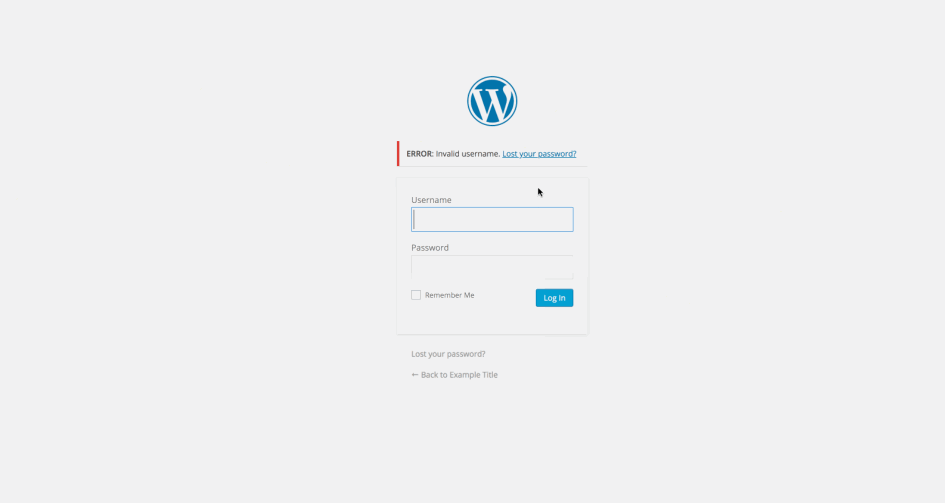
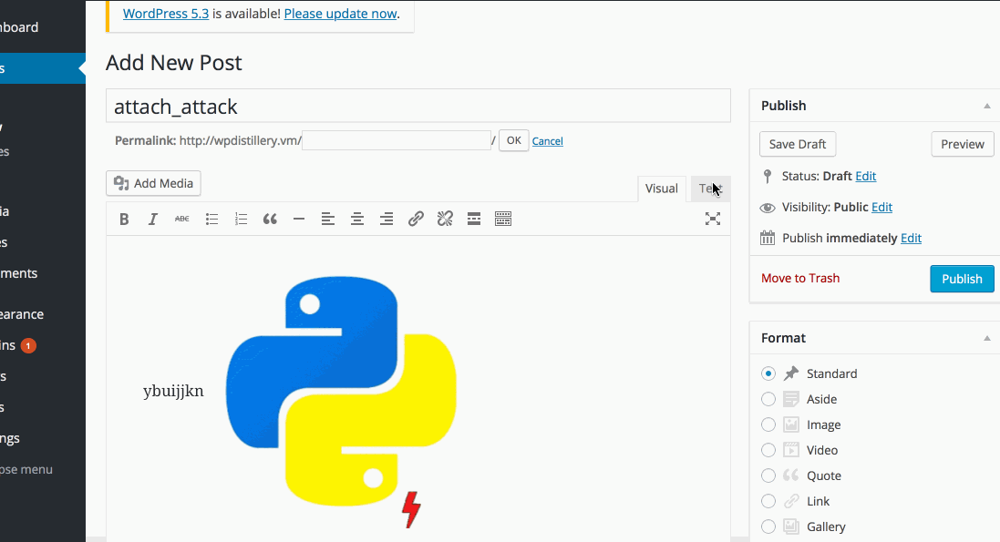
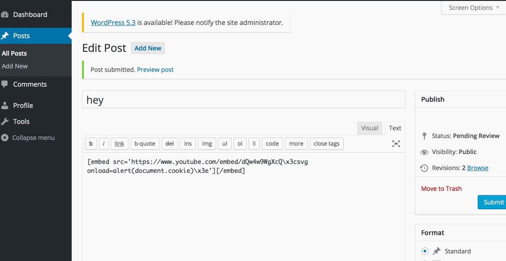

# Project 7 - WordPress Pentesting

Time spent: **15** hours spent in total

> Objective: Find, analyze, recreate, and document **five vulnerabilities** affecting an old version of WordPress

## Pentesting Report

1. (Required) User ID Enumeration
  - [x] Summary:  The system was able to detect if any specific username exists or when we login with any username and password as admin
    - Vulnerability types: user authentication
    - Tested in version: 4.7
    - Fixed in version: N/A
  - [x] GIF Walkthrough: 
  - [x] Steps to recreate: Enter "admin" as username and type random passwords. Enter different names as username and type "admin" as password. Try different attempts and at end typoe admin and admin to log in. 

    
1. (Required) Authenticated Cross-Site Scripting (XSS) via Media File Metadata
  - [x] Summary: This vulnerability will inject arbitrary web script and abuses the insufficient validation of the file names of uploaded images.
    - Vulnerability types: XSS
    - Tested in version: 4.2
    - Fixed in version: 4.2.13
  - [x] GIF Walkthrough: 
  - [x] Steps to recreate: Create a new media post and upload an image with the following filename format:
        filename.jpeg
    
1. (Required)  Authenticated Shortcode Tags Cross-Site Scripting (XSS)
  - [x] Summary:  A stored Cross-Site script XSS vulnerablilty which allows remote attackers to inject arbitrary web script/HTML by abusing the way unclosed HTML elements during the processing of shortcode tags are mishandled.
    - Vulnerability types: XSS
    - Tested in version:4.2
    - Fixed in version: 4.2.1
  - [x] GIF Walkthrough: 
  - [x] Steps to recreate: Create a new post and place the following code in the body: 
      <a href="" "onclick=alert(1)">check</a>

## Assets

List any additional assets, such as scripts or files

## Resources

- [WordPress Source Browser](https://core.trac.wordpress.org/browser/)
- [WordPress Developer Reference](https://developer.wordpress.org/reference/)

GIFs created with [LiceCap](http://www.cockos.com/licecap/).

## Notes

Describe any challenges encountered while doing the work

## License

    Copyright 2019 Abdur Rafey

    Licensed under the Apache License, Version 2.0 (the "License");
    you may not use this file except in compliance with the License.
    You may obtain a copy of the License at

        http://www.apache.org/licenses/LICENSE-2.0

    Unless required by applicable law or agreed to in writing, software
    distributed under the License is distributed on an "AS IS" BASIS,
    WITHOUT WARRANTIES OR CONDITIONS OF ANY KIND, either express or implied.
    See the License for the specific language governing permissions and
    limitations under the License.
